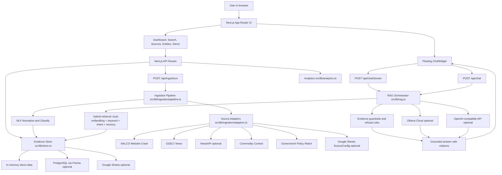

# NALCO Intelligence Bot

NALCO Intelligence Bot is a production-style market intelligence application for National Aluminium Company Limited (NALCO). It combines a polished Next.js interface, source ingestion, deterministic NLP, retrieval-augmented generation, evidence search, source transparency, and a floating assistant that answers only from verified evidence.

The project is designed to work in two modes:

- **Demo/local mode:** runs without a database or API keys by using seeded in-memory evidence.
- **Connected mode:** persists evidence to PostgreSQL or Google Sheets, refreshes live public sources, and optionally formats answers through Ollama Cloud or OpenAI-compatible APIs.

## Table of Contents

- [Core Features](#core-features)
- [Architecture Diagram](#architecture-diagram)
- [Tech Stack](#tech-stack)
- [Project Structure](#project-structure)
- [Frontend Architecture](#frontend-architecture)
- [Backend Architecture](#backend-architecture)
- [RAG and Answering Pipeline](#rag-and-answering-pipeline)
- [Ingestion Pipeline](#ingestion-pipeline)
- [Data Storage](#data-storage)
- [Source Quality and Evidence Rules](#source-quality-and-evidence-rules)
- [Environment Variables](#environment-variables)
- [Local Development](#local-development)
- [Commands](#commands)
- [Testing](#testing)
- [Deployment Notes](#deployment-notes)
- [Operational Notes](#operational-notes)

## Core Features

- **Floating NALCO assistant:** chat widget available across the main app routes, with streaming responses, citations, confidence, evidence date range, detected entities, and live-refresh metadata.
- **Evidence-first answers:** the assistant refuses private, unsupported, live-price, or unverifiable claims instead of hallucinating.
- **Professional refusal handling:** unsupported questions receive a polished explanation and suggested source-backed follow-up topics.
- **Dashboard:** dense intelligence interface for document counts, sentiment, market signals, policy mentions, high-impact events, and latest evidence.
- **Evidence search:** hybrid keyword/vector-style retrieval over normalized documents.
- **Source library:** browsable evidence cards with source type, sentiment, materiality, entities, dates, and links to original sources.
- **Source detail pages:** full document view with summary, metadata, entities, commodities, geographies, policymakers, and original URLs.
- **Entity explorer:** overview of detected companies, commodities, geographies, regulators, policymakers, and risk factors.
- **Data source status:** source integration health, configured source visibility, and manual ingestion trigger.
- **Live ingestion hooks:** route-level heartbeat can refresh public evidence when important pages load.
- **Demo fallback:** useful sample NALCO evidence is bundled so the application remains usable without external services.

## Architecture Diagram



## Tech Stack

- **Framework:** Next.js 16 App Router
- **Language:** TypeScript
- **UI:** React 19, Tailwind CSS 4, custom component classes, lucide-react icons
- **Backend:** Next.js route handlers
- **Persistence:** in-memory fallback, Prisma/PostgreSQL, optional Google Sheets
- **NLP/RAG:** deterministic extraction, local hashed embeddings, keyword scoring, intent boosts, evidence guardrails
- **LLM formatting:** optional Ollama Cloud or OpenAI-compatible chat completions
- **Validation:** Zod
- **Testing:** Playwright, TypeScript compiler, ESLint

## Project Structure

```text
.
├── src
│   ├── app
│   │   ├── api                    # Backend route handlers
│   │   ├── dashboard              # Intelligence dashboard page
│   │   ├── demo                   # Recruiter/demo presentation page
│   │   ├── entities               # Entity explorer page
│   │   ├── search                 # Evidence search page
│   │   ├── sources                # Source library and source details
│   │   ├── globals.css            # Global design system and animations
│   │   ├── layout.tsx             # Root shell and page-load ingestion hook
│   │   └── page.tsx               # Landing page
│   ├── components
│   │   ├── app-shell.tsx          # Route-aware application shell
│   │   ├── chat-widget.tsx        # Floating assistant UI and streaming client
│   │   ├── demo-shell.tsx         # Demo page shell
│   │   ├── document-card.tsx      # Evidence card component
│   │   ├── ingest-button.tsx      # Manual ingestion trigger
│   │   ├── metric-card.tsx        # Dashboard KPI card
│   │   ├── page-load-ingestion.tsx# Browser heartbeat ingestion
│   │   ├── source-library.tsx     # Source library and status layouts
│   │   └── ui.tsx                 # Shared low-level UI helpers
│   └── lib
│       ├── analytics.ts           # Dashboard aggregate calculations
│       ├── demo-data.ts           # Seeded fallback evidence
│       ├── env.ts                 # Environment schema
│       ├── evidence-quality.ts    # Evidence validation and date hygiene
│       ├── google-sheets.ts       # Optional Google Sheets persistence
│       ├── ingestion              # Source adapters and ingestion pipeline
│       ├── nlp                    # Dictionaries, extraction, embeddings
│       ├── ollama.ts              # Ollama Cloud streaming client
│       ├── prisma.ts              # Prisma client singleton
│       ├── rag.ts                 # Retrieval, guardrails, answer generation
│       ├── source-status.ts       # Integration health metadata
│       ├── store.ts               # Storage abstraction
│       ├── types.ts               # Shared domain types
│       └── utils.ts               # Formatting and class helpers
├── prisma
│   ├── migrations                 # PostgreSQL schema migration
│   ├── schema.prisma              # Document and ingestion run models
│   └── seed.ts                    # Demo data seed script
├── scripts
│   └── run-ingestion.ts           # CLI ingestion runner
├── tests
│   └── e2e                        # Playwright tests
├── ARCHITECTURE.md                # Short architecture notes
├── DEPLOYMENT.md                  # Deployment checklist
├── DEMO_SCRIPT.md                 # Demo talking points
└── package.json                   # Scripts and dependencies
```

## Frontend Architecture

### App Shell

[src/components/app-shell.tsx](src/components/app-shell.tsx) decides which shell to render based on the route:

- The landing page gets a minimal wrapper and the floating assistant.
- Dashboard, sources, entity, search, and demo pages render their own full-screen shells.
- Secondary routes fall back to a simple sticky header with navigation.

The assistant is mounted from the shell so users can ask questions without leaving their current workflow.

### Landing Page

[src/app/page.tsx](src/app/page.tsx) introduces the product and routes users into:

- `/dashboard`
- `/search?q=latest%20NALCO%20announcements`
- `/sources`
- `/demo`
- `/api/health`

It uses lucide icons, dark enterprise styling, capability cards, and source/RAG/assistant feature highlights.

### Dashboard

[src/app/dashboard/page.tsx](src/app/dashboard/page.tsx) is an async server component. It calls `overview()` from [src/lib/analytics.ts](src/lib/analytics.ts), then renders:

- KPI cards
- sentiment score
- market signal visualization
- latest documents
- high-impact events
- source/entity summaries

The dashboard reads from the same evidence store as the assistant, so the displayed intelligence and chat answers stay aligned.

### Search

[src/app/search/page.tsx](src/app/search/page.tsx) uses `retrieveDocuments()` from the RAG module to return evidence-ranked documents. It displays retrieval scores, source labels, dates, and links to source details or original URLs.

If there are no results, the UI now provides a professional suggestion instead of a blunt failure message.

### Source Library and Source Status

[src/components/source-library.tsx](src/components/source-library.tsx) powers:

- `/sources`
- `/sources/status`

The source library includes filters for source type and sentiment, card-level metadata, entity chips, materiality scores, and links to detailed evidence pages. The status view surfaces integration health and configured source information.

### Chat Widget

[src/components/chat-widget.tsx](src/components/chat-widget.tsx) is the main assistant client. It supports:

- modal assistant layout
- suggested prompts
- streaming Server-Sent Events from `/api/chat/stream`
- fallback JSON call to `/api/chat`
- citations
- confidence chips
- evidence date range
- live-refresh status
- entity chips
- professional fallback messages

The widget first tries the streaming endpoint. If streaming is unavailable, it falls back to the JSON endpoint. If both fail, it shows a user-friendly retry message.

### Page-Load Ingestion

[src/components/page-load-ingestion.tsx](src/components/page-load-ingestion.tsx) can trigger ingestion in the browser when selected routes load:

- `/dashboard`
- `/entities`
- `/sources`
- `/sources/status`
- `/demo`

It calls `/api/ingest/run?mode=page-load`, respects a cooldown, and refreshes the route when ingestion completes.

## Backend Architecture

The backend is implemented with Next.js route handlers in `src/app/api`.

| Route | Method | Purpose |
| --- | --- | --- |
| `/api/health` | `GET` | Basic health check with app name and timestamp. |
| `/api/documents` | `GET` | Lists normalized evidence documents. |
| `/api/documents/[id]` | `GET` | Returns one document by id or hash key. |
| `/api/entities` | `GET` | Returns top extracted entities. |
| `/api/analytics/overview` | `GET` | Returns dashboard aggregate data. |
| `/api/search?q=` | `GET` | Returns ranked retrieval results. |
| `/api/chat` | `POST` | Returns a full JSON chat answer. |
| `/api/chat/stream` | `POST` | Streams status, answer deltas, metadata, and done events. |
| `/api/ingest/run` | `POST` | Runs ingestion with cooldown behavior for page-load mode. |
| `/api/sources/status` | `GET` | Returns source integration statuses. |

### API Validation

Chat endpoints validate request bodies with Zod:

```ts
z.object({ question: z.string().min(2).max(1000) })
```

Invalid questions return `400` instead of reaching the RAG pipeline.

## RAG and Answering Pipeline

The RAG system lives mainly in [src/lib/rag.ts](src/lib/rag.ts).

### Step 1: Live Refresh

Before answering, `prepareAnswer()` calls `refreshEvidenceForChat()`. The refresh function:

- runs ingestion at most once per five minutes
- reuses an in-flight refresh if another chat request is already refreshing
- returns metadata such as fetched count, failed URLs, retried URLs, and source statuses

This keeps chat answers connected to recent source data without triggering excessive crawling.

### Step 2: Intent Detection

The RAG layer detects several query categories:

- latest NALCO news
- entity map
- risk summary
- aluminium market context
- filings or investor information
- current/live commodity price requests
- private, confidential, undisclosed, or unannounced claim requests

These intents influence retrieval, filtering, and refusal behavior.

### Step 3: Retrieval

Documents are ranked using a hybrid score:

- local hashed embedding cosine similarity
- keyword matches
- intent-specific boosts
- source-type boosts
- recency boosts
- quality penalties for PDF metadata-only records

Specialized retrievers exist for entity maps, risk summaries, and aluminium market questions so those prompts get relevant evidence instead of generic matches.

### Step 4: Evidence Adequacy

`hasAdequateEvidence()` checks whether the retrieved documents are actually good enough to answer the user. It considers:

- top retrieval score
- query terms
- intent-specific evidence types
- entity availability
- source quality
- whether the source is only PDF metadata

If evidence is not adequate, the bot refuses professionally.

### Step 5: Guardrails

The bot refuses or limits responses for:

- private or undisclosed claims
- confidential or leaked information
- unannounced information
- live commodity prices when no live commodity API is configured
- unrelated or weak evidence

The current refusal messages explain the reason and suggest source-backed topics instead of returning a terse error.

### Step 6: Answer Generation

If evidence is adequate:

1. The RAG layer creates a compact evidence packet with numbered sources.
2. If Ollama is configured, it streams a polished answer from Ollama Cloud.
3. If Ollama is not configured but OpenAI is configured, it uses the OpenAI-compatible client.
4. If no LLM is configured, it returns a deterministic grounded fallback summary.

Every non-refusal answer includes:

- answer text
- confidence score
- evidence date range
- extracted entities
- citations
- live-refresh metadata

## Ingestion Pipeline

The ingestion flow is implemented in:

- [src/lib/ingestion/adapters.ts](src/lib/ingestion/adapters.ts)
- [src/lib/ingestion/pipeline.ts](src/lib/ingestion/pipeline.ts)
- [scripts/run-ingestion.ts](scripts/run-ingestion.ts)

### Source Adapters

Adapters collect raw items from:

- NALCO official website pages
- NALCO media and press release pages
- NALCO investor pages
- NALCO financial results and annual reports
- GDELT news
- NewsAPI, when `NEWS_API_KEY` is configured
- commodity context sources
- government policy monitoring
- Google Sheets `SourceConfig`, when configured

### NALCO Crawl Behavior

The NALCO crawler:

- starts from configured NALCO root pages
- follows NALCO HTML links
- avoids images, archives, spreadsheets, documents, and PDFs for full crawl
- records PDF links as metadata where appropriate
- extracts canonical URLs
- infers published dates from metadata, page content, or URL patterns
- classifies pages into source types such as press release, financial result, annual report, investor announcement, policy, or news
- tracks failed URLs, retried URLs, and successful NALCO page counts

### Pipeline Steps

`runIngestion()` performs:

1. `fetchSources()` from all adapters.
2. error and source-status collection.
3. deduplication by URL or source/title key.
4. normalization through `normalizeDocument()`.
5. persistence through `upsertDocuments()`.
6. optional ingestion-run append to Google Sheets.

## NLP Layer

The NLP layer lives under `src/lib/nlp`.

### Dictionaries

[src/lib/nlp/dictionaries.ts](src/lib/nlp/dictionaries.ts) defines domain-specific terms for:

- companies
- commodities
- geographies
- policymakers
- regulators
- government bodies
- event types
- risk factors

### Extraction and Normalization

[src/lib/nlp/extraction.ts](src/lib/nlp/extraction.ts) handles:

- document normalization
- text cleanup
- entity extraction
- commodity extraction
- geography extraction
- policymaker extraction
- event classification
- sentiment classification
- materiality scoring
- local embedding generation
- cosine similarity
- hash keys for deduplication

This deterministic layer gives the app useful intelligence even when no LLM is configured.

## Data Storage

The storage abstraction lives in [src/lib/store.ts](src/lib/store.ts).

The priority order is:

1. **Google Sheets**, if configured and readable.
2. **PostgreSQL via Prisma**, if `DATABASE_URL` is configured and not a local file URL.
3. **In-memory demo documents**, always available as fallback.

### Prisma Schema

[prisma/schema.prisma](prisma/schema.prisma) defines:

- `Document`
- `IngestionRun`

The `Document` model stores normalized text, summaries, entities, commodities, geographies, policymakers, source metadata, event classification, sentiment, materiality score, embeddings, and hash keys.

### Google Sheets Mode

[src/lib/google-sheets.ts](src/lib/google-sheets.ts) can use a service account to manage:

- `Documents`
- `SourceConfig`
- `IngestionRuns`

This is useful for lightweight persistence and source configuration without a database server.

## Source Quality and Evidence Rules

The app is intentionally conservative.

Important evidence rules:

- Do not present fallback commodity context as a live price.
- Do not invent private or undisclosed business relationships.
- Do not answer if evidence is weak, unrelated, or missing.
- Prefer official, investor, exchange, policy, and indexed source citations.
- Sanitize document dates before exposing evidence.
- Deduplicate documents by URL/hash.
- Keep citations attached to factual answers.

The professional refusal behavior is part of this evidence discipline, not a failure of the bot.

## Environment Variables

Copy `.env.example` to `.env` for local development:

```bash
cp .env.example .env
```

For Vercel, use [.env.vercel.example](.env.vercel.example) as the safe template and copy the values into Vercel Project Settings. Never upload a real `.env` file.

| Variable | Purpose |
| --- | --- |
| `DATABASE_URL` | Pooled PostgreSQL connection string for Prisma runtime persistence. Use Supabase's pooled URL on Vercel. Leave empty for demo fallback. |
| `DIRECT_URL` | Direct PostgreSQL connection string for Prisma migrations. Use Supabase's direct URL when running `prisma migrate deploy`. |
| `OPENAI_API_KEY` | Optional OpenAI-compatible API key. |
| `OPENAI_BASE_URL` | Optional custom OpenAI-compatible base URL. |
| `OPENAI_MODEL` | Model name for OpenAI-compatible answers. |
| `OLLAMA_API_KEY` | Optional Ollama Cloud API key. |
| `OLLAMA_HOST` | Ollama host, defaults to `https://ollama.com`. |
| `OLLAMA_MODEL` | Ollama model name. |
| `GOOGLE_SHEETS_ID` | Optional spreadsheet id for persistence/configuration. |
| `GOOGLE_SERVICE_ACCOUNT_JSON_BASE64` | Base64-encoded Google service account JSON. |
| `NEWS_API_KEY` | Optional NewsAPI key. |
| `GDELT_ENABLED` | Enables or disables GDELT ingestion. Defaults to `false` for free deployment safety. |
| `COMMODITY_API_KEY` | Optional commodity feed key. Required before quoting live commodity prices. |
| `SCRAPER_USER_AGENT` | User agent for source crawling. |
| `INGEST_TIMEOUT_MS` | Fetch timeout for ingestion requests. |
| `NALCO_CRAWL_CONCURRENCY` | Crawl concurrency for NALCO pages. |
| `NALCO_CRAWL_MAX_PAGES` | Max NALCO pages to crawl per run. |
| `INGESTION_INTERVAL_MINUTES` | Page-load ingestion cooldown. |
| `NEXT_PUBLIC_APP_NAME` | Display/app name. |
| `APP_BASE_URL` | Base app URL. |
| `ENABLE_LIVE_INGEST` | Enables live ingestion features. Defaults to `false`; turn on only after configuring production source limits. |
| `ENABLE_PAGE_LOAD_INGEST` | Enables browser heartbeat ingestion. Defaults to `false`; keep off on free Vercel deployments unless needed. |
| `NALCO_MOCK_LIVE_SOURCES` | Uses local mock live sources for fast, reliable tests. |

## Local Development

Install dependencies:

```bash
npm install
```

Create a local environment file:

```bash
cp .env.example .env
```

Run the app:

```bash
npm run dev
```

Open:

```text
http://localhost:3000
```

For reliable local testing with mock ingestion:

```bash
NALCO_MOCK_LIVE_SOURCES=true npm run dev
```

## Commands

| Command | Purpose |
| --- | --- |
| `npm run dev` | Start the Next.js dev server. |
| `npm run build` | Generate Prisma client with a safe fallback URL, then build the production app. |
| `npm run start` | Start the production build. |
| `npm run lint` | Run ESLint. |
| `npm run typecheck` | Run TypeScript checks. |
| `npm run test` | Run Playwright tests. |
| `npm run test:e2e` | Run Playwright tests. |
| `npm run prisma:generate` | Generate Prisma client. |
| `npm run prisma:migrate` | Run Prisma migrations in development. |
| `npm run prisma:seed` | Seed demo data into the configured store. |
| `npm run ingest` | Run source ingestion from the CLI. |

## Testing

The Playwright suite in [tests/e2e/app.spec.ts](tests/e2e/app.spec.ts) covers:

- NALCO HTML extraction
- missing-date behavior
- search result filtering
- main route rendering
- visible navigation
- chatbot open/close behavior
- chatbot citation rendering
- mobile chatbot layout
- search workflow
- source library and detail pages
- source status page
- demo sidebar behavior
- API route validation
- refusal behavior for private claims and live price requests

Recommended validation before pushing:

```bash
npm run typecheck
npm run lint
NALCO_MOCK_LIVE_SOURCES=true npm run test
```

## Deployment Notes

The app can be deployed to Vercel or another Node-compatible host. Vercel settings are pinned in [vercel.json](vercel.json), and upload exclusions are listed in [.vercelignore](.vercelignore).

Recommended first Vercel setup:

- Deploy with demo memory data first.
- Copy [.env.vercel.example](.env.vercel.example) values into Vercel environment variables.
- Keep `ENABLE_LIVE_INGEST=false`, `ENABLE_PAGE_LOAD_INGEST=false`, and `GDELT_ENABLED=false` on the free tier.
- Set `NALCO_MOCK_LIVE_SOURCES=true` if you want predictable demo refresh metadata.

Recommended production setup after the demo is stable:

- PostgreSQL database through Supabase, Neon, RDS, or another provider.
- `DATABASE_URL` configured with the pooled Postgres URL in the hosting platform.
- `DIRECT_URL` configured with the direct Postgres URL for Prisma migrations.
- Scheduled or manual call to `POST /api/ingest/run`.
- Optional Google Sheets only if spreadsheet-based persistence/configuration is desired.
- Optional Ollama or OpenAI-compatible API credentials for polished generated answers.
- `COMMODITY_API_KEY` only when live commodity price answers are required.

Run before deployment:

```bash
npm run build
```

If using Prisma with a real database:

```bash
DATABASE_URL="your_supabase_pooled_url" DIRECT_URL="your_supabase_direct_url" npx prisma migrate deploy
```

Do not use a Supabase personal access token for RAG storage. The deployed app needs Supabase Postgres connection strings, not the Supabase Management API token.

## Operational Notes

- The app remains usable without external credentials because `demoDocuments` seed the memory store.
- Page-load ingestion should be enabled carefully in production; scheduled ingestion is usually more predictable.
- The assistant is designed to be conservative. A refusal means the evidence standard is working.
- The `playwright-report/`, `test-results/`, `.next/`, `node_modules/`, environment files, and TypeScript build info are ignored because they are generated or machine-local artifacts.
- Do not commit real `.env` files or service account JSON.
- If a user wants live aluminium prices, configure a reliable commodity data provider and update the commodity adapter to store verified live price evidence.
